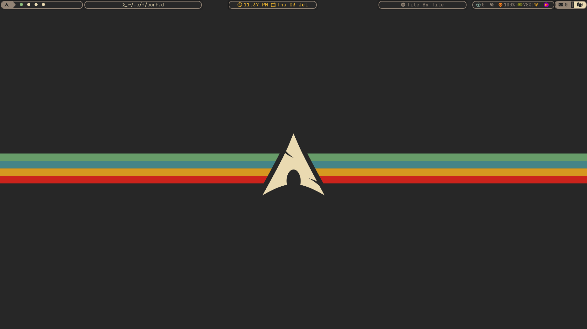

# 🧠 Dotfiles – Arch + BSPWM Setup

<p>This repository contains the custom configuration I use in my Arch Linux environment with [BSPWM] as the window manager. It includes minimalist and efficient tools for daily productivity, development, and full system control from the keyboard. </p>
---

## Main view (Gruvbox ftw)



## Workflow


---

## 📁 Structure

```bash
dotfiles/
├── config/
│   ├── bspwm/
│   ├── sxhkd/
│   ├── polybar/
│   ├── rofi/
│   ├── fish/
│   └── ...
├── scripts/
├── previews/
│   └── workflow.png
└── README.md

# archdotfiles
