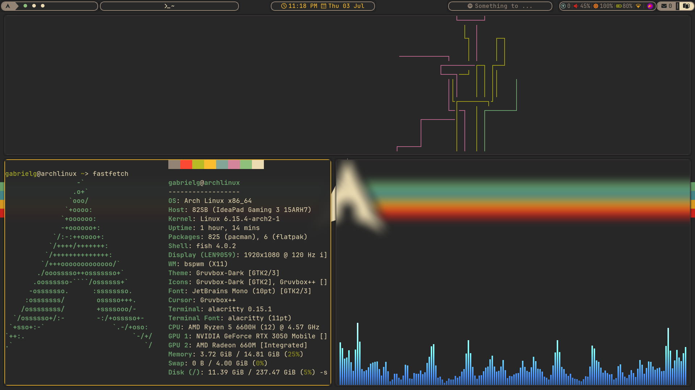

# 🧠 Dotfiles – Arch + BSPWM Setup

Este repositorio contiene la configuración personalizada que uso en mi entorno de Arch Linux con [BSPWM](https://github.com/baskerville/bspwm) como window manager. Incluye herramientas minimalistas y eficientes para productividad diaria, desarrollo y control total del sistema desde el teclado.

---

## Vista general



---

## 📁 Estructura

```bash
dotfiles/
├── config/
│   ├── bspwm/
│   ├── sxhkd/
│   ├── polybar/
│   ├── rofi/
│   ├── fish/
│   └── ...
├── scripts/
├── previews/
│   └── workflow.png
└── README.md

# archdotfiles
